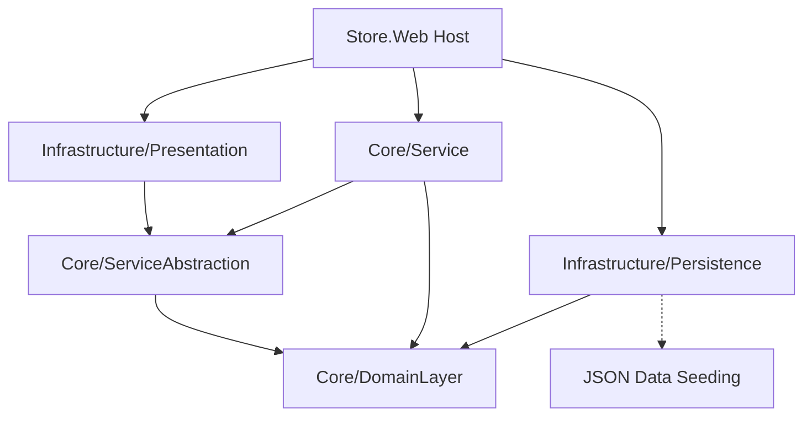

# Store.Web


An advanced product catalog and store API leveraging .NET 8 and Clean Architecture/Onion paradigms. The system features a fully decoupled design, comprehensive EF Core initial migrations, and robust JSON-based data seeding capabilities for rapid deployment and testing.

## 🏗️ Architecture



## 📂 Project Structure

| Layer | Project | Description |
|---|---|---|
| **Domain** | `Core/DomainLayer` | Entities (`BaseEntity`, `Product`, `ProductBrand`, `ProductType`) & Contracts (`IDataSeeding`). |
| **Service Interfaces** | `Core/ServiceAbstraction` | Abstractions referencing the Shared layer. |
| **Service Implementation** | `Core/Service` | Business logic implementations. |
| **Data Access** | `Infrastructure/Persistence` | EF Core 8 integrations, `ProductConfigurations`, InitialCreate migrations, and `DataSeed` logic. |
| **API** | `Infrastructure/Presentaion` | Presentation layer and routing logic. |
| **Shared** | `Shared/Shared` | Shared types and cross-cutting utilities. |
| **Host** | `Store.Web` | Startup project including default controllers (`WeatherForecastController`). |

## 🌟 Features
- **JSON Data Seeding:** Ships with pre-configured seed data for `products.json`, `brands.json`, `delivery.json`, and `types.json`.
- **Domain-Driven Design:** Strong focus on encapsulated core domain entities.
- **EF Core Migrations:** Fully structured migration histories starting from `InitialCreate`.

## 🚀 Getting Started

### Prerequisites
- [.NET 8 SDK](https://dotnet.microsoft.com/download/dotnet/8.0)
- SQL Server

### Installation & Execution

```bash
# 1. Clone the repository
git clone https://github.com/OmarAlfar0uk/Store.Web.git

# 2. Navigate to the project root
cd Store.Web

# 3. Restore dependencies
dotnet restore

# 4. Run the application
dotnet run --project Store.Web
```

---

## 👨‍💻 Author

**Omar Alfarouk**
- GitHub: [OmarAlfar0uk](https://github.com/OmarAlfar0uk)
- LinkedIn: [omar-alfarouk-252471251](https://www.linkedin.com/in/omar-alfarouk-252471251/)
- Email: [omaralfarouk646@gmail.com](mailto:omaralfarouk646@gmail.com)
