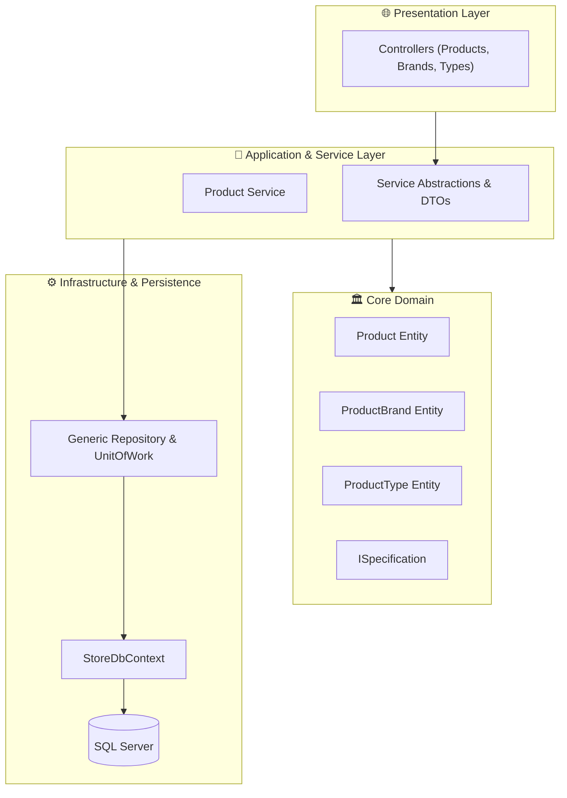

<div align="center">

# 🛍️ Store.Web
### Enterprise E-Commerce Platform Built with Clean Architecture & Specification Pattern

[](https://dotnet.microsoft.com/)
[](https://learn.microsoft.com/en-us/dotnet/csharp/)
[](#-system-architecture)
[](#-architecture-patterns)
[](LICENSE)
[](https://github.com/OmarAlfar0uk)

<p align="center">
  <a href="#-key-features">Key Features</a> •
  <a href="#-system-architecture">System Architecture</a> •
  <a href="#-tech-stack">Tech Stack</a> •
  <a href="#-project-structure">Project Structure</a> •
  <a href="#-getting-started">Getting Started</a> •
  <a href="#-author">Author</a>
</p>

</div>

---

## 📌 Executive Overview

**Store.Web** is a high-performance e-commerce backend built with ASP.NET Core, engineered around Clean Architecture and enterprise design patterns. It provides an extensible catalog and inventory system featuring Brands, Categories, and Products with dynamic filtering, sorting, and pagination supported by the **Specification Pattern** and generic repository abstractions.

> [!NOTE]
> Employs the **Specification Pattern** to encapsulate complex LINQ query logic (sorting, filtering, pagination, and eager loading of navigation properties) cleanly outside repository classes.

---

## ✨ Key Features

| ⚡ Feature | 💡 Description | 🛠 Engineering Detail |
|---|---|---|
| **📦 Dynamic Product Catalog** | Products categorized by `ProductBrand` and `ProductType` | Entity Framework Core relational mappings with foreign keys |
| **🔍 Specification Pattern** | Composable querying (search, filter, sort, paginate) | Decouples query logic via `ISpecification<T>` |
| **🗄️ Generic Repository & UoW** | Reusable data access layer | Centralized repository with Unit of Work pattern |
| **⚡ High Performance** | Asynchronous queries with projection support | Minimized query overhead and optimized indexing |
| **🛡️ Layer Isolation** | Clear boundary between Core and Infrastructure | Zero database dependencies in domain models |

---

## 🏛 System Architecture



---

## ⚡ Tech Stack

| Category | Technology | Purpose |
|---|---|---|
| **Platform** |   | Enterprise Web API framework |
| **Patterns** |   | Clean domain modeling and composable query construction |
| **Data & ORM** |   | Relational persistence, fluent configurations, and migrations |

---

## 📂 Project Structure

```text
Store.Web/
├── Core/
│   ├── DomainLayer/             # Entities: Product, ProductBrand, ProductType, BaseEntity
│   ├── Service/                 # Business logic services
│   └── ServiceAbstraction/      # Service contracts & interfaces
├── Infrastructure/
│   ├── Persistence/             # StoreDbContext, Migrations, Repository implementations
│   └── Presentaion/             # Web API Presentation controllers
├── Store.Web/                   # Application host, Program.cs & config
└── Store.Web.sln
```

---

## 🚀 Getting Started

1. **Clone repository:**
   ```bash
   git clone https://github.com/OmarAlfar0uk/Store.Web.git
   cd Store.Web
   ```

2. **Build & Run:**
   ```bash
   dotnet restore
   dotnet run --project Store.Web
   ```

---

## 👨‍💻 Author

**Omar Alfarouk**  
*Full-Stack .NET & Software Engineer*  

- 🌐 **GitHub:** [@OmarAlfar0uk](https://github.com/OmarAlfar0uk)
- 💼 **LinkedIn:** [omar-alfarouk](https://www.linkedin.com/in/omar-alfarouk-252471251/)
- 📧 **Email:** [omaralfarouk646@gmail.com](mailto:omaralfarouk646@gmail.com)

---

<div align="center">
  <sub>Built with ❤️ by Omar Alfarouk. Licensed under the <a href="LICENSE">MIT License</a>.</sub>
</div>
